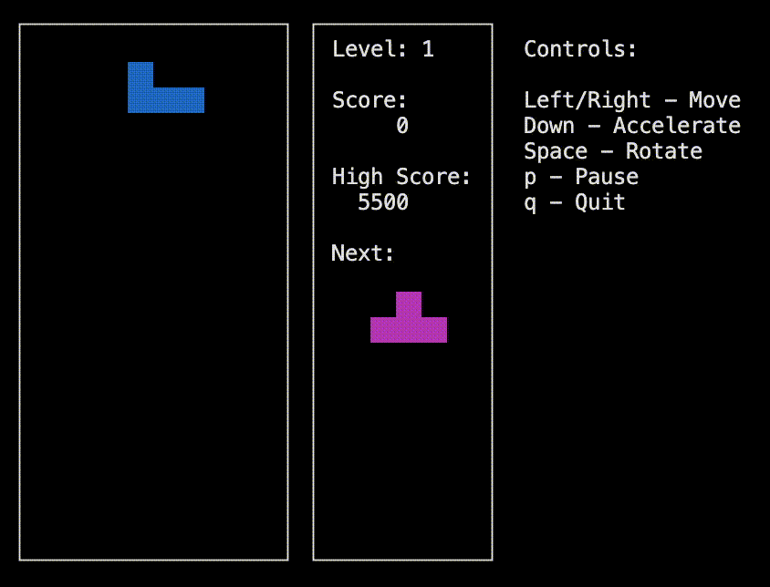

# Tetris in C

## Project Overview

This project is a simple implementation of the classic Tetris game in a Finite-State Machine (FSM) approach. It is developed using C and provides a terminal-based interface for the game with the help of `ncurses` library. The code is structured into several modules for the game logic, frontend, and testing. The project includes Makefile scripts for building the game, running tests, and generating code coverage reports.

<p style="text-align:center;">
</p>

## Project Structure

```bash
├── README.md
├── materials
│   ├── build
│   │   └── Docker
│   │       ├── Dockerfile
│   │       ├── readme.txt
│   │       ├── run.sh
│   │       └── start.sh
│   ├── images
│   │   └── tetris.gif
│   └── linters
└── src
    ├── Doxyfile
    ├── Makefile
    ├── brick_game
    │   └── tetris
    │       ├── backend.c
    │       ├── states.c
    │       └── tetromino.c
    ├── build
    ├── fsm_scheme.pdf
    ├── gui
    │   └── cli
    │       └── frontend.c
    ├── highscore.txt
    ├── inc
    │   ├── backend.h
    │   ├── frontend.h
    │   ├── states.h
    │   ├── tetris.h
    │   └── tetromino.h
    ├── main.c
    └── tests
        ├── test_backend.c
        ├── test_suite.c
        ├── test_suite.h
        └── test_tetromino.c
```

## Build Instructions
### Requirements
- `GCC`
- `Make`
- `ncurses` library for terminal graphics
- `Doxygen` (optional, for generating documentation)
- `Docker` (optional, for building the project in a Docker container)

### Build the Game

To build the game, simply run:

```bash
make
```
This will compile the game and create the executable in the src/build/ directory.

### Run the Game
To play the game, run:

```bash
make play
```

### Testing
#### Unit Tests
The project includes unit tests for the backend and tetromino logic. To run the tests, use:

```bash
make test
```
#### Leak Checks
To test the program for leaks, run:
```bash
make test_leaks
```
It will choose between `leaks` and `valgrind` leak-checking utilities depending on your OS. If you're not using Linux and want to check it with Valgrind, having Docker installed and launched, run:
```bash
make docker
```
#### Code Coverage
To generate a code coverage report, run:

```bash
make gcov_report
```
This will generate an HTML report in the src/build/gcov_report/ directory and automatically open it in your default browser.

### Static Analysis and Formatting
#### Code Style
The project uses `clang-format` for code style enforcement. To format the code, run:

```bash
make style
```
#### Static Analysis
To run static analysis on the code using `cppcheck`, run:

```bash
make statictest
```
### Documentation
To generate documentation for the project in both LaTeX and HTML format, first, make sure you have [Doxygen](https://www.doxygen.nl/download.html) installed.

Then, run:
```bash
make dvi
```
This will open the HTML version of the documentation in your browser. You can access both versions in the generated `doxygen-output/` folder.

## Additional Information
- High Scores: High scores are saved in `src/highscore.txt`.
- Finite State Machine Scheme: The `src/fsm_scheme.pdf` file contains the finite state machine diagram used for managing game states.
- Tetromino Shapes: The shapes and rotations of tetrominos are defined in `src/inc/tetris.h`.